# HiSpark_AiFly介绍<a name="ZH-CN_TOfigures_0000001142448981"></a>

-   [简介](#section11660541593)
-   [开发板详情](#section11660542704)
-   [开发板规格](#section11660543815)
-   [开发环境搭建](#section11660544925)
    -   [开发环境准备](#section11660544926)
        -   [操作系统](#section11660544928)
    -   [环境依赖准备](#section11660544927)
        -   [前提条件](#section11660544929)
    -   [获取源码操作步骤](#section11660544930)
        -   [OpenHarmony-SIG仓](#section11660544934)
            -   [方式 1：repo + SSH（需配置公钥）](#section11660544931)
            -   [方式 2：repo + HTTPS](#section11660544932)
        -   [OpenHarmony-6.1-LTS](#section11660544935)
            -   [方式 1：repo + SSH（需配置公钥）](#section11660544936)
            -   [方式 2：repo + HTTPS](#section11660544937)
        -   [执行 prebuilts 下载工具链](#section11660544933)
-   [目录](#section161941989596)
-   [构建说明](#section19369206113115)
    -   [OpenHarmony-SIG仓](#section19369206113116)
    -   [OpenHarmony-6.1-LTS](#section19369206113117)
-   [烧录说明](#section19369206114230)
    -   [烧写配置依赖](#section19369206114231)
        -   [串口配置](#section19369206114232)
        -   [网口配置](#section19369206114233)
        -   [硬件连接](#section19369206114234)
    -   [方式一：ToolPlatform工具烧写（Windows）](#section19369206114235)
    -   [方式二：命令行烧写（Linux/Windows）](#section19369206114238)
    -   [方式三：USB自动烧写（Windows）](#section19369206114239)
-   [快速体验](#section_quick_start)
    -   [桌面展示](#section_quick_start_desktop)
    -   [相机应用](#section_quick_start_camera)
    -   [媒体播放](#section_quick_start_media)
-   [约束](#section119744591305)
-   [协议说明](#section1312121216216)
-   [相关仓](#section1371113476307)

## 简介<a name="section11660541593"></a>

HiSpark_AiFly是基于海思Hi3403V100 IPC芯片，打造的OpenHarmony小型系统的端侧AI微算力平台。芯片搭载异构加速算力，对接ModelZoo开源生态可直接调用80+成熟AI视觉算法模型，一站式实现模型部署与本地推理。面向AI视觉研发、机器智能、高校教学全场景开放，是集4K60的AI ISP图像处理、10TOPS视觉AI计算、MIPI屏桌面显示、Camera和多媒体的软硬件一体化的开发套件，可快速落地智慧安防、工业视觉、智慧家居、机器人和无人机等领域。

## 开发板详情<a name="section11660542704"></a>
图1：HiSpark_AiFly开发套件正面接口示意图
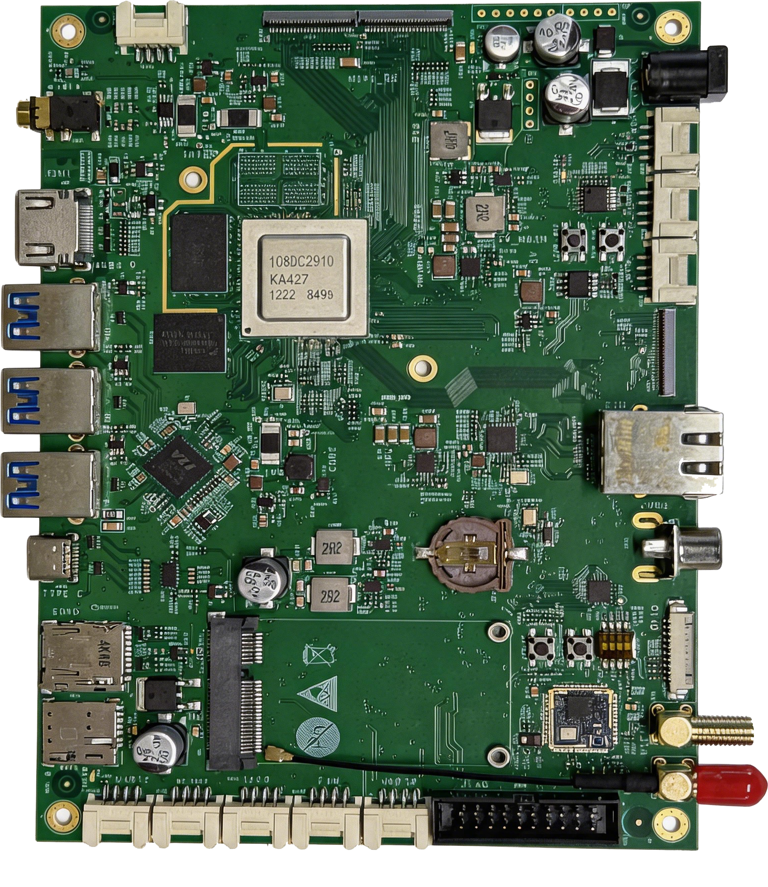

图2：HiSpark_AiFly开发套件背面接口示意图
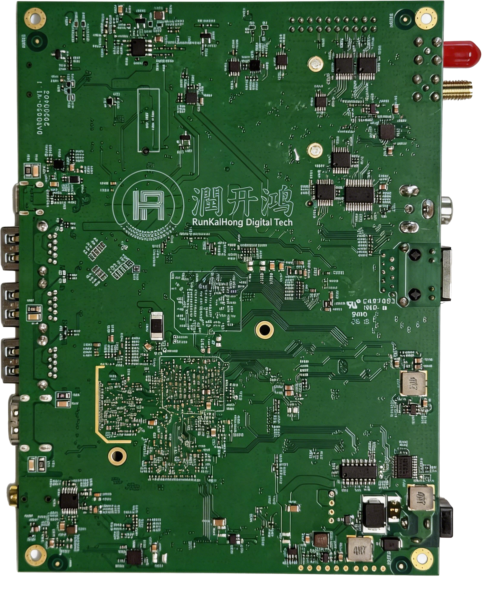

图3：HiSpark_AiFly开发板功能接口定义
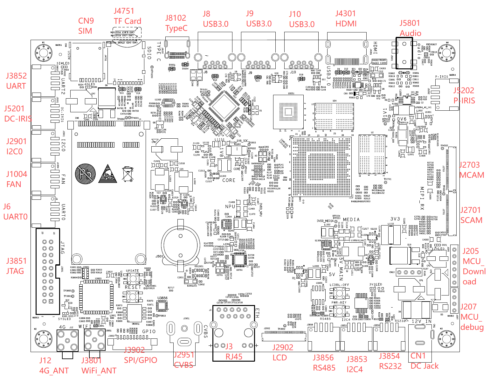

## 开发板规格<a name="section11660543815"></a>
表1：HiSpark_AiFly开发套件接口规格说明
| 规格项目         | 规格描述                                                                 |
|------------------|--------------------------------------------------------------------------|
| 处理器           | 海思3403（4核A55）, 最高主频1.4GHz                                      |
| 内存             | 板载LPDDR4X内存，4 GB                                                    |
| 存储             | 默认32GB eMMC，可定制16GB/64GB/128GB                                     |
| 以太网           | 10/100/1000M自适应网卡<br>1个以太网 (RJ45) 端口                          |
| Reset复位按钮    | 通过此按钮，可将产品参数配置恢复为出厂值                                 |
| 开关机           | 通过MCU控制SoC开关机                                                    |
| 工作温度         | 0～50°C（宽温级可选）                                                   |
| 存储温度         | -25°C ～75°C                                                            |
| 工作湿度         | 0%～95%RH, 非凝结                                                       |
| 尺寸             | 165mm*120mm                                                             |
| USB              | 3个USB 3.0（Type A）端口，1个USB 3.0 TypeC端口                           |
| 音频             | 独立的音频输入输出口                                                     |
| 显示             | 1路HDMI2.0(最高 1080P @60Hz), 1路MIPI LCD                                |
| Camera           | 提供两路4lane 摄像头接口                                                |
| Wifi/BT          | 内置BT/WiFi模组                                                         |
| 4G               | MiniPCI-E插座（支持4G模块）                                             |
| IRIS             | DC-IRIS接口，P-IRIS接口                                                 |
| 串口             | 1路RS-232口；1路RS-485口，2路3.3v I2C口，1路UART外设口，1路SPI，5*GPIO  |
| TF卡             | 支持1路Push-Push TF卡座                                                 |
| SIM/UIM 卡接口   | 标准的抽屉式用户卡接口，支持 1.8V/3V SIM/UIM 卡                          |
| 指示灯           | 具有"系统电源", "SYS", "SIM", "Online"等指示灯                          |
| 天线接口         | 蜂窝：1 个标准 SMA 阴头天线接口，特性阻抗 50 欧<br>WIFI：1 个标准 SMA 阳头天线接口，特性阻抗 50 欧 |
| CVBS             | 支持1路CVBS插座                                                         |
| 风扇             | 1个风扇插座 (4-pin)                                                     |
| 电源             | 1个DC JACK接口座，12V输入                                               |
| 其他             | 1个调试串口，1个JTAG调试口                                              |


# 开发环境搭建<a name="section11660544925"></a>

## 开发环境准备<a name="section11660544926"></a>

### 操作系统<a name="section11660544928"></a>
- Ubuntu 20.04 LTS（推荐） / Ubuntu 18.04，X86_64 架构，内存推荐 16 GB 及以上。
- Ubuntu 系统的用户名不能包含中文字符。

## 环境依赖准备<a name="section11660544927"></a>

### 前提条件<a name="section11660544929"></a>
1. 注册 GitCode 账号。
2. 注册 SSH 公钥。
3. 安装 git 客户端和 git-lfs 并配置用户信息。
```
git config --global user.name "yourname"
git config --global user.email "your-email-address"
git config --global credential.helper store
```
4. 安装码云 repo 工具
```
curl -s https://gitee.com/oschina/repo/raw/fork_flow/repo-py3 > /usr/local/bin/repo
chmod a+x /usr/local/bin/repo
pip3 install -i https://repo.huaweicloud.com/repository/pypi/simple requests
```
5. 安装编译 OpenHarmony 所需依赖库和工具
```
sudo apt-get update && sudo apt-get install binutils binutils-dev git git-lfs gnupg flex bison gperf build-essential zip curl zlib1g-dev gcc-multilib g++-multilib libc6-dev-i386 lib32ncurses5-dev x11proto-core-dev libx11-dev lib32z1-dev ccache libgl1-mesa-dev libxml2-utils xsltproc unzip m4 bc gnutls-bin python3.8 python2.7 python3-pip ruby genext2fs device-tree-compiler make libffi-dev e2fsprogs pkg-config perl openssl libssl-dev libelf-dev libdwarf-dev u-boot-tools mtd-utils cpio doxygen liblz4-tool openjdk-8-jre gcc g++ texinfo dosfstools mtools default-jre default-jdk libncurses5 apt-utils wget scons python3.8-distutils tar rsync git-core libxml2-dev lib32z-dev grsync xxd libglib2.0-dev libpixman-1-dev kmod jfsutils reiserfsprogs xfsprogs squashfs-tools pcmciautils quota ppp libtinfo-dev libtinfo5 libncurses5-dev libncursesw5 libstdc++6 gcc-arm-none-eabi vim ssh locales libxinerama-dev libxcursor-dev libxrandr-dev libxi-dev dwarves libnl-3-dev libnl-genl-3-dev autoconf automake libtool
```
6. 查看 Python 路径
```
which python3.8
```
7. 配置 Python 版本
```
sudo update-alternatives --install /usr/bin/python3 python3 {Python 3.8路径} 1  #{Python 3.8 路径}为上一步查看的Python 3.8的位置
```
## 获取源码操作步骤<a name="section11660544930"></a>

### OpenHarmony-SIG仓<a name="section11660544934"></a>

#### 方式 1：repo + SSH（需配置公钥）<a name="section11660544931"></a>
```
repo init -u git@gitcode.com/openharmony-sig/manifest -m devboard_hispark_aifly_5.1.0.xml
repo sync -c
repo forall -c 'git lfs pull'
```
#### 方式 2：repo + HTTPS<a name="section11660544932"></a>
```
repo init -u https://gitcode.com/openharmony-sig/manifest -m devboard_hispark_aifly_5.1.0.xml
repo sync -c
repo forall -c 'git lfs pull'
```
### OpenHarmony-6.1-LTS<a name="section11660544935"></a>

#### 方式 1：repo + SSH（需配置公钥）<a name="section11660544936"></a>
```
repo init -u  git@gitcode.com/openharmony/manifest -b OpenHarmony-6.1-LTS --no-repo-verify
repo sync -c
repo forall -c 'git lfs pull'
```
#### 方式 2：repo + HTTPS<a name="section11660544937"></a>
```
repo init -u  https://gitcode.com/openharmony/manifest -b OpenHarmony-6.1-LTS --no-repo-verify
repo sync -c
repo forall -c 'git lfs pull'
```
### 执行 prebuilts 下载工具链<a name="section11660544933"></a>
```
bash build/prebuilts_download.sh
```
下载的预编译工具默认存放路径：与 OpenHarmony 同目录下的 openharmony_prebuilts。

## 目录<a name="section161941989596"></a>

```
├── BUILD.gn                   # 编译框架GN文件
├── ohos.build                 # 构建配置文件
├── README_zh.md               # 项目说明文档
├── kernel                     # 内核相关文件
│   ├── batch_sign_ko.sh       # 内核模块批量签名脚本
│   ├── BUILD.gn               # 编译框架GN文件
│   ├── kernel.mk              # 用于配置内核编译交叉工具链、源码环境、defconfig等信息
│   ├── kernel_module_build.sh # 内核编译入口shell脚本文件
│   ├── LICENSE                # 许可证文件
│   └── README_zh.md           # 内核说明文档
├── linux                      # Linux相关配置
│   ├── config.gni             # 用于描述产品样例所使用的单板、内核、工具链、编译器等信息
│   └── LICENSE                # 许可证文件
└── figures                    # 图片资源目录
```

## 构建说明<a name="section19369206113115"></a>

### OpenHarmony-SIG仓<a name="section19369206113116"></a>

1. 配置SDK编译工具链
   SDK包提供内核驱动源码和Sample源码，可以通过源码进行编译。在编译前，需要配置编译工具链，将编译工具链路径加入到环境变量中。
   将Clang编译工具链路径添加到环境变量中，执行：export PATH=/path/to/toolchains:$PATH
   例如，Clang所在的：/path/to/prebuilts/clang/ohos/linux-x86_64/llvm/bin
   ```
        export PATH=/path/to/prebuilts/clang/ohos/linux-x86_64/llvm/bin:$PATH
   ```
   检查 Clang 配置环境变量是否生效
   ```
        command -v clang
   ```

2. 初次编译：

   编译前请先手动修改 build/hb/util/system_util.py 第55行成如下内容：
   ```
        while "" in cmd and type(cmd) == list:
   ```

   初次编译需要打补丁，添加编译参数--patch，编译命令：  
      ```
        ./build.sh --product-name ipcamera_hispark_aifly_linux --ccache  --no-prebuilt-sdk --patch 
      ```
  
   > 注 撤消patch方法：
   >如需撤销patch.yml中所有patch，执行vendor/hisilicon/hispark_aifly_linux下的patch_revert.py脚本，如：
   >```
   >   cd vendor/hisilicon/hispark_aifly_linux
   >   python3 patch_revert.py
   >```
   >也可手动撤消单个patch，例如取消build仓patch，可在build目录下执行
   >```
   >patch -p1 -R < ../device/soc/hisilicon/patches/build/build_001.patch
   >```

3. 后续编译(打完patch后)：跳过打patch环节，去掉编译参数--patch，执行命令：

   ```
   ./build.sh --product-name ipcamera_hispark_aifly_linux --ccache  --no-prebuilt-sdk
   ```

### OpenHarmony-6.1-LTS<a name="section19369206113117"></a>

1. 配置SDK编译工具链
   SDK包提供内核驱动源码和Sample源码，可以通过源码进行编译。在编译前，需要配置编译工具链，将编译工具链路径加入到环境变量中。
   将Clang编译工具链路径添加到环境变量中，执行：export PATH=/path/to/toolchains:$PATH
   例如，Clang所在的：/path/to/prebuilts/clang/ohos/linux-x86_64/llvm/bin
   ```
        export PATH=/path/to/prebuilts/clang/ohos/linux-x86_64/llvm/bin:$PATH
   ```
   检查 Clang 配置环境变量是否生效
   ```
        command -v clang
   ```


2. 在源码根目录下执行以下命令完成全量编译：

   ```
   ./build.sh --product-name ipcamera_hispark_aifly_linux --ccache --no-prebuilt-sdk
   ```

构建选项说明：

| 选项                                          | 说明                              |
| --------------------------------------------- | --------------------------------- |
| `--product-name ipcamera_hispark_aifly_linux` | 指定产品名称，必选                |
| `--ccache`                                    | 启用编译缓存，加速重复编译        |
| `--no-prebuilt-sdk`                           | 跳过 SDK 子系统编译，缩短构建时间 |
| `--patch`                                     | 初次编译时应用芯片平台补丁        |

## 烧录说明<a name="section19369206114230"></a>

HiSpark_AiFly开发板支持三种烧录方式：
- **方式一**：ToolPlatform工具烧写（Windows）
- **方式二**：命令行烧写（Linux/Windows）
- **方式三**：USB自动烧写（Windows）

前两种烧录方式依赖串口和网口连接，方式三依赖USB连接，烧录前需提前完成相关配置。

### 烧写配置依赖<a name="section19369206114231"></a>

#### 串口配置<a name="section19369206114232"></a>
1. **USB串口驱动安装**
   - 下载驱动包：[串口驱动](https://file.wch.cn/download/file?id=65) (注意：当前驱动的只针对CH340 usb转串口模组，不同的usb转串口模组需要安装对应的驱动)
   - 安装驱动包
   - 重启PC
   - 连接串口线，在设备管理器中查看是否识别到串口设备
   
   图4：串口设备识别图
   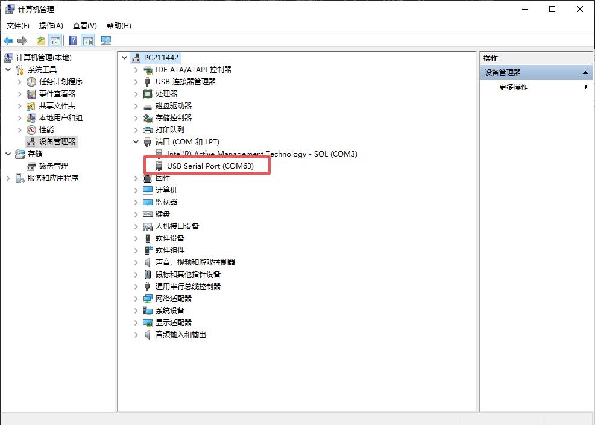

#### 网口配置<a name="section19369206114233"></a>
- 使用网线连接开发板和PC
- 根据烧录方式配置网络参数（详见各烧录方式说明）

#### 硬件连接<a name="section19369206114234"></a>
- 12V电源适配器供电
- 网线连接开发板和PC

   图5：HiSpark_AiFly开发套件接线图
   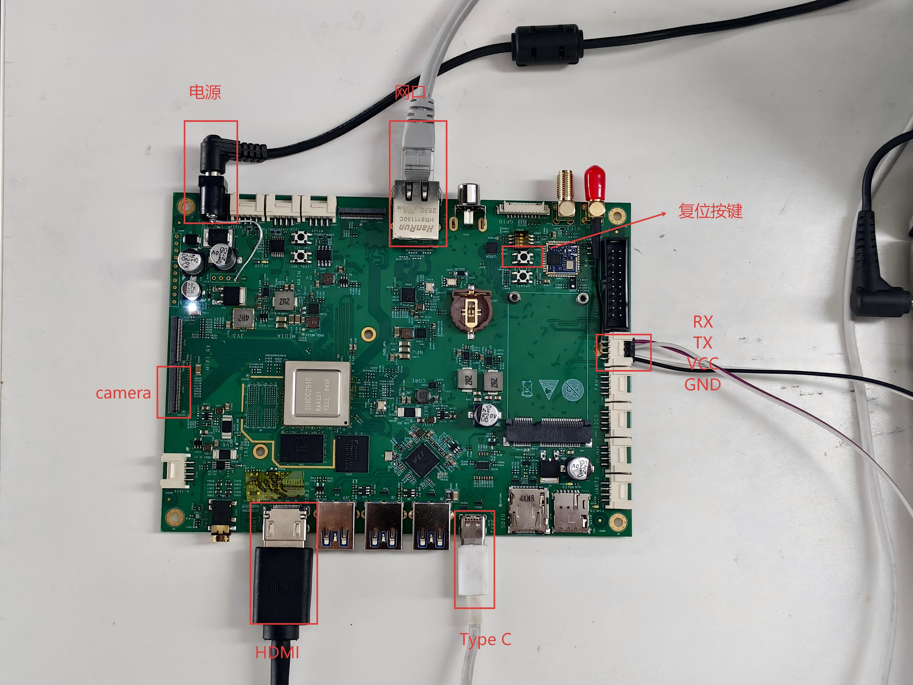
- 串口连接示例：
   ```bash
   板子串口         usb串口设备
   RX     连接       TX
   TX     连接       RX
   VCC    不连接     VCC
   GND    连接       GND
   （备注:usb串口模组连接电脑且usb串口设备实际线序根据设备标注的线序进行连接）
   ```
   图6：串口连接示例
   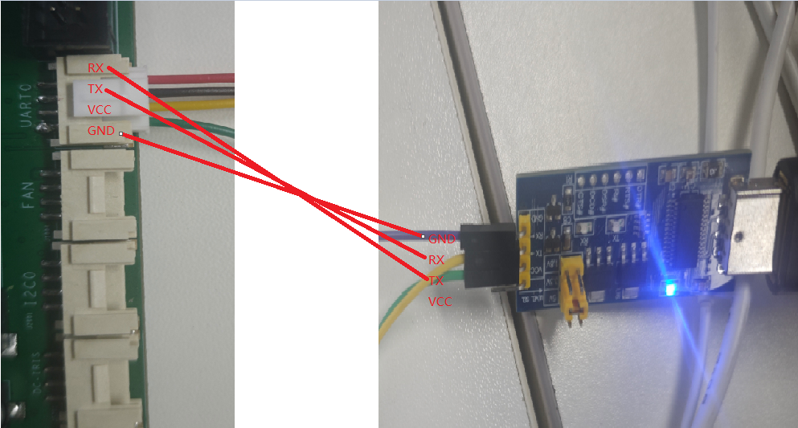

- 相机模组连接示例：
图7：相机模组连接示例
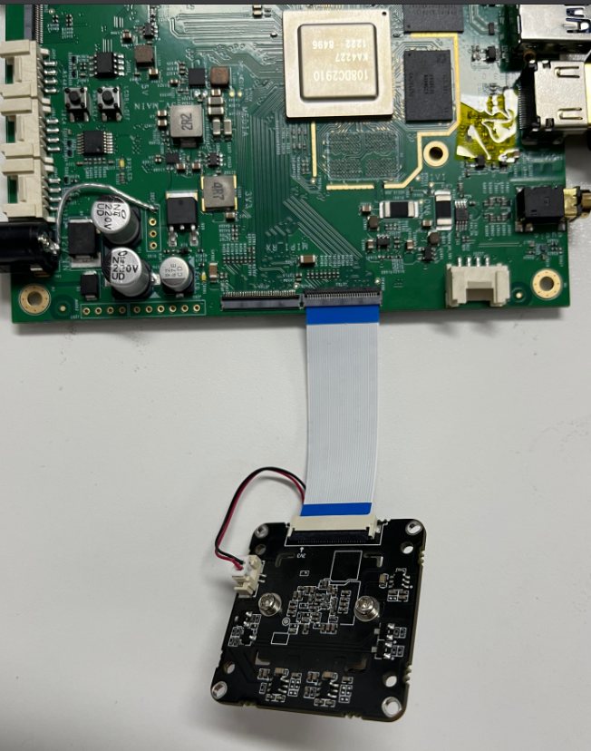

- 其他外设连接示例：
   - HDMI连接带音频的HDMI显示器
   - HDC使用TYPE-C连接电脑USB接口
   图8：其它外设连接示例
   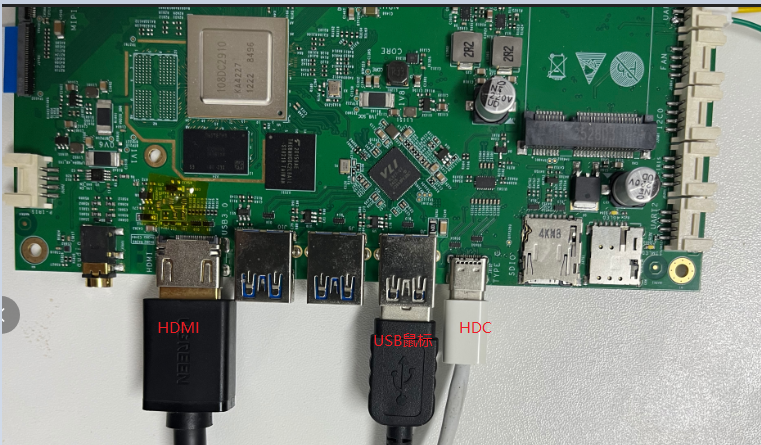

### 方式一：ToolPlatform工具烧写（Windows）<a name="section19369206114235"></a>

#### 网口烧写

##### 前置步骤

1. **下载安装烧录工具**
   - 下载安装 [ToolPlatform](https://hispark-obs.obs.cn-east-3.myhuaweicloud.com/ToolPlatform-CAM-5.6.79-win32-x86_64.zip)
   - 下载并安装 [Tftpd64](https://pjo2.github.io/tftpd64/)

2. **准备烧录镜像**
   
   图9：镜像示例
   
   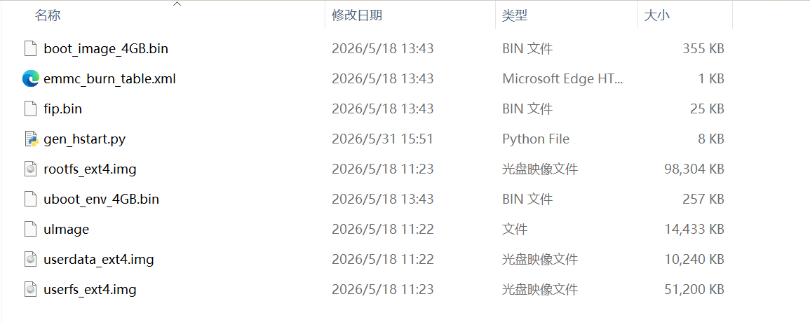
   
3. **配置Tftpd64**
   
   用于提升toolplatform工具的烧录效率。
   图10：Tftpd配置
   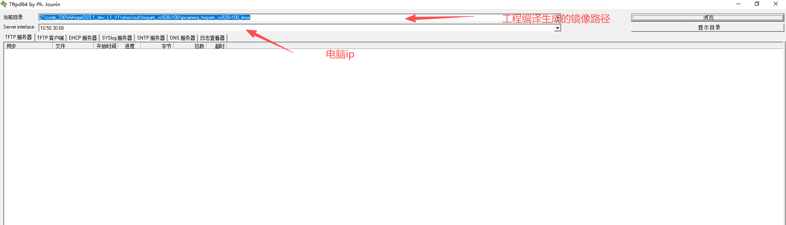

##### 烧录步骤
1. **配置ToolPlatform**
   
   图11：ToolPlatform配置
   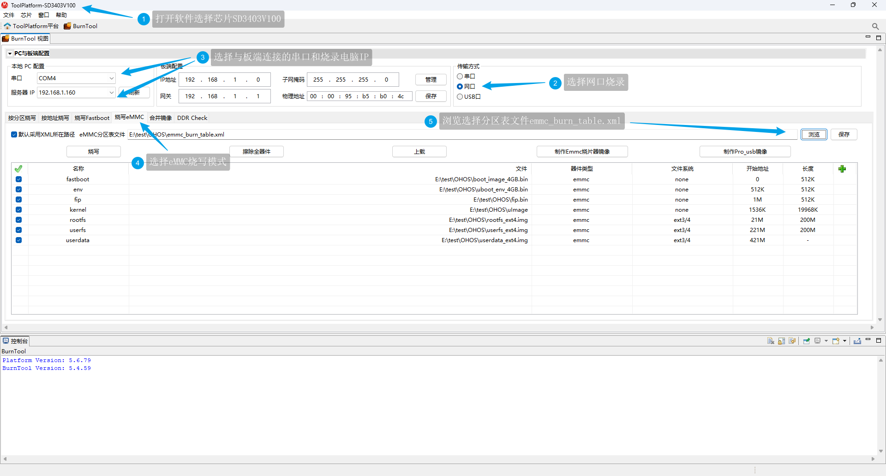

2. **执行烧录**
   - 点击烧录按钮
   - 按下板子的复位按键
   - 等待烧录完毕

**注意事项**：
- 烧录前，不要使用其他串口工具连接设备，否则会占用串口导致烧录失败

#### USB烧写<a name="section19369206114236"></a>

##### 前置步骤

1. **下载安装烧录工具**
   - 下载安装 [ToolPlatform](https://hispark-obs.obs.cn-east-3.myhuaweicloud.com/ToolPlatform-CAM-5.6.79-win32-x86_64.zip)
   - 板端已烧录过uboot固件
   - 安装USB驱动：下载 [zadig](https://zadig.akeo.ie)，双击运行，选择 `Options->List All Devices`，点击选择List All Devices。

     图12：zadig选择设备
     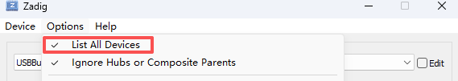

     重启开发板，敲击回车进入uboot命令行模式，输入 `usb device`（超时退出请重新输入）。

     图13：zadig输入usb device
     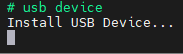

     在zadig中选择 `USBBurn`，安装驱动 `libusb-win32`。

     **注：若安装libusb-win32后重启电脑无法烧写，说明该驱动不适用，请改用 `libusbK` 驱动重新安装。**

     图14：zadig安装libusb-win32
     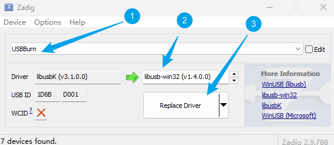

     安装完成后PC设备管理器出现 `USBBurn` 设备，然后重启开发板。

     图15：zadig安装完成
     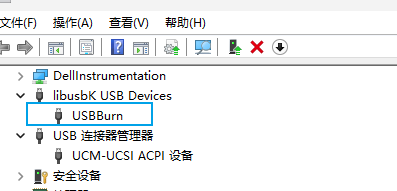

2. **准备烧录镜像**

   图16：镜像示例
   
   

##### 烧录步骤

1. **配置ToolPlatform**

   图17：ToolPlatform配置
   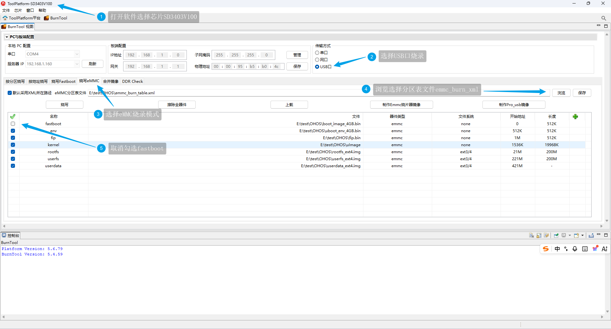

2. **执行烧录**
   - 点击烧录按钮
   - 同时按下 `RESET` 和 `UPDATE` 按键，1秒后松开 `RESET`，保持按住 `UPDATE`
   - 待控制台显示红色 `Open usb success` 后松开 `UPDATE`；若5秒内未显示，则再次按下并松开 `RESET`，直到显示成功
   - 等待烧录完毕

### 方式二：命令行烧写（Linux/Windows）<a name="section19369206114238"></a>

#### 前置步骤

1. **部署TFTP服务**

   **Windows**：
   - 打开Tftpd64，选择Tftp Server
   - 设置路径 `/tftpboot`
   - 服务端IP为客户端IP或回环地址 `127.0.0.1`

   **Ubuntu**：
   ```bash
   apt-get update
   apt-get -y install tftpd-hpa
   mkdir /tftpboot
   chmod 777 /tftpboot
   ```

   编辑 `/etc/default/tftpd-hpa`，修改以下内容：
   ```
   TFTP_USERNAME="tftp"
   TFTP_DIRECTORY="/tftpboot"
   TFTP_ADDRESS="0.0.0.0:69"
   TFTP_OPTIONS="-l -c -s"
   ```

   重启服务使配置生效：
   ```bash
   systemctl restart tftpd-hpa.service
   ```

2. **环境准备**
   - 客户端拥有Python 3环境
   - 串口线和网线已连接客户端与开发板
   - 开发板已烧录u-boot镜像
   - 准备TFTP目录并拷贝烧录文件至 `/tftpboot`

3. **准备烧录镜像**

   图18：镜像示例

   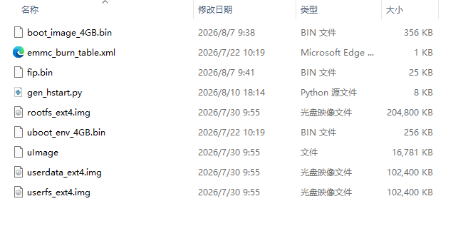

4. **生成histart脚本**

   ```bash
   cd /tftpboot
   python3 gen_hstart.py emmc_burn_table.xml
   ```

   输出：在XML所在目录生成 `histart.txt` 和 `scripts/` 文件夹。

#### 烧录步骤

1. **连接串口**
   - 使用串口线连接开发板和PC
   图19：串口工具波特率配置图

   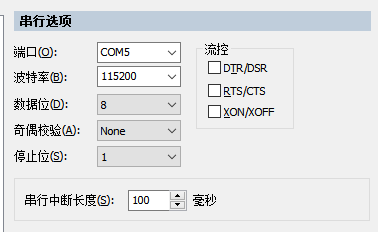

2. **进入u-boot命令行**
   - 重启开发板
   - 按下 `Ctrl+C` 进入u-boot命令行

3. **配置网络**
   根据实际环境修改IP配置：
   ```bash
   setenv serverip <server_ip>
   setenv ethaddr 00:cf:55:38:4f:0a
   setenv ipaddr <board_ip>
   setenv netmask 255.255.255.0
   setenv gatewayip <gateway_ip>
   ```

4. **执行烧录**
   ```bash
   histart
   ```

5. **完成烧录**
   - 烧录完成后开发板自动重启
   
   图20：HiSpark_AiFly开发套件启动图
   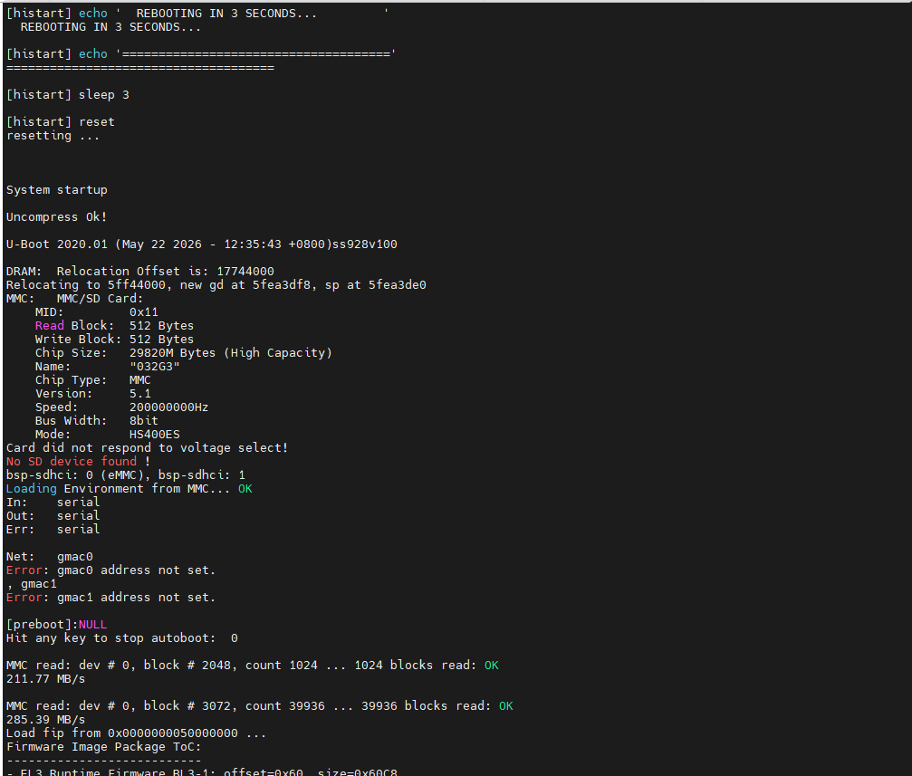

### 方式三：USB自动烧写（Windows）<a name="section19369206114239"></a>

支持同时烧录多块开发板。

#### 前置步骤

1. **下载安装烧录工具**
   
   - 下载安装 [BurnToolCLI](https://hispark-obs.obs.cn-east-3.myhuaweicloud.com/BurnToolCLI-5.6.48-win32-x86_64.zip)（Windows版，本处以Windows为例）；另有[Linux版](https://hispark-obs.obs.cn-east-3.myhuaweicloud.com/BurnToolCLI-5.6.48-linux-x86_64.zip)，使用方法请阅读BurnToolCLI下的readme
   - 板端已烧录过uboot固件
   - 安装USB驱动：步骤同[**方式一的USB烧写**](#section19369206114236)——下载 [zadig](https://zadig.akeo.ie)，为 `USBBurn` 设备安装 `libusb-win32` 驱动（若重启电脑后无法烧写，请改用 `libusbK` 驱动）
   
2. **准备烧录镜像**

   图21：镜像示例
   
   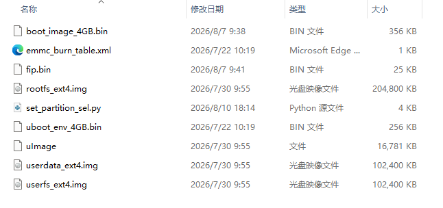

#### 烧录步骤

1. 将固件目录 `images` 拷贝到命令行烧录工具 `BurnToolCLI` 目录下

   图22：拷贝images目录
   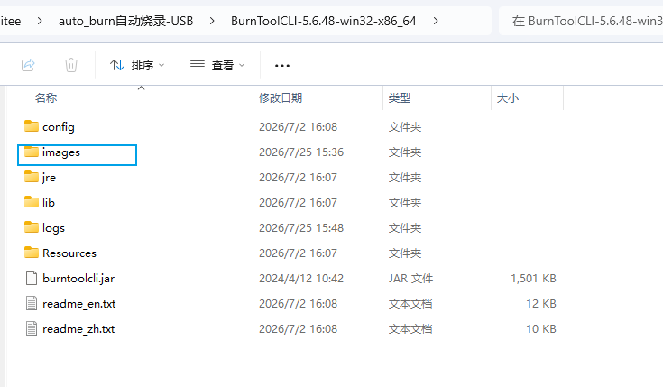

2. 在 `BurnToolCLI` 目录下打开cmd终端，执行 `set_partition_sel.py` 脚本

   ```bash
   cd images
   python3 set_partition_sel.py
   cd ..
   ```

   图23：执行分区选择脚本
   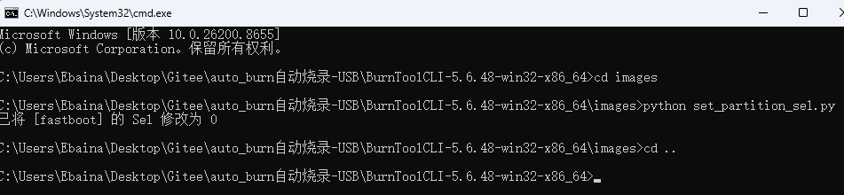

3. 打开 `config\burn.config`，修改 `usbDeviceNumber=0` 并保存；若只烧录一块开发板，可跳过本步骤，直接执行步骤7、8。

4. 回到PC CMD终端执行USB烧录命令，开始烧录并查看识别到的USB号

   ```bash
   .\jre\bin\java -jar -Xms256m -Xmx1024m burntoolcli.jar --burn -n SD3403V100 -m USBBootrom -x .\images\emmc_burn_table.xml
   ```

   图24：查看USB号
   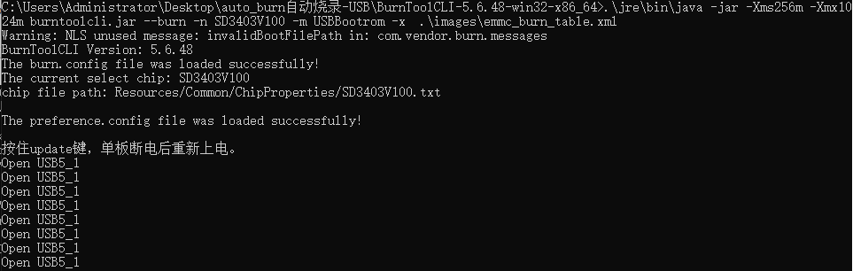

   图25：查看USB号
   

   例如识别到USB号为 `5_1` 和 `10`。

5. 复制 `BurnToolCLI` 目录，烧录几块板子就打开几个cmd窗口

   图26：复制BurnToolCLI目录
   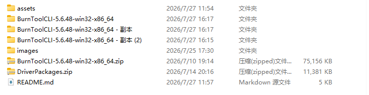

   图27：打开多个cmd窗口
   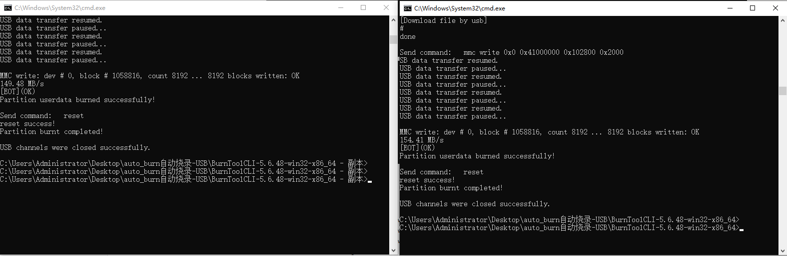

6. 修改 `usbDeviceNumber=识别到的USB号`（多板烧录时指定其中一个，其余保持默认，即可同时烧录）

   图28：修改usbDeviceNumber
   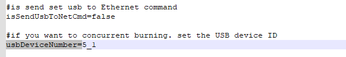

7. 所有板端输入以下命令进入USB烧录模式

   ```bash
   devmem 0x11021300 4 0xFFFFFFFF && reboot
   ```

8. 回到PC，在所有CMD终端再次执行USB烧录命令，开始烧录

   ```bash
   .\jre\bin\java -jar -Xms256m -Xmx1024m burntoolcli.jar --burn -n SD3403V100 -m USBBootrom -x .\images\emmc_burn_table.xml
   ```

**注意：** 烧录完成后开发板自动重启；若烧录中断，开发板超时1分钟后将自动重启。

## 快速体验<a name="section_quick_start"></a>

烧录完成后，通过HDMI连接显示器，上电启动系统即可体验HiSpark_AiFly的桌面系统。

### 桌面展示<a name="section_quick_start_desktop"></a>

系统启动后，显示器将展示OpenHarmony桌面界面。

图29：HiSpark_AiFly桌面展示


### 相机应用<a name="section_quick_start_camera"></a>

1. 在桌面点击**相机**应用图标，打开相机。
2. 点击拍摄按钮完成拍照，缩略图将显示在屏幕左上角。

图30：相机拍照展示
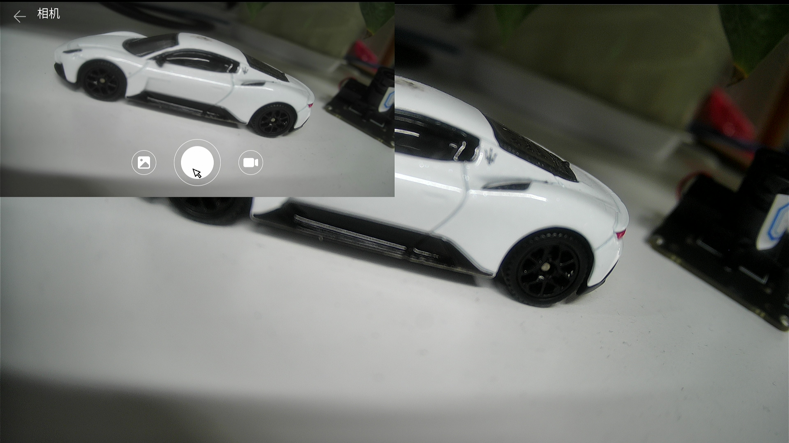

### 媒体播放<a name="section_quick_start_media"></a>

1. 将视频文件拷贝至板端 `/userdata/photo/` 目录，也可使用相机应用录像录制视频。
2. 在桌面点击**图库**应用，打开图库查看照片和视频。
3. 点击视频文件即可开始播放。

图31：图库展示


图32：视频播放展示


## 约束<a name="section119744591305"></a>

当前支持Hi3403V100芯片。

## 协议说明<a name="section1312121216216"></a>

参见对应目录的LICENSE文件及代码声明

## 相关仓<a name="section1371113476307"></a>

[vendor_hisilicon](https://gitee.com/openharmony/vendor_hisilicon)

[device_soc_hisilicon](https://gitee.com/openharmony/device_soc_hisilicon)

